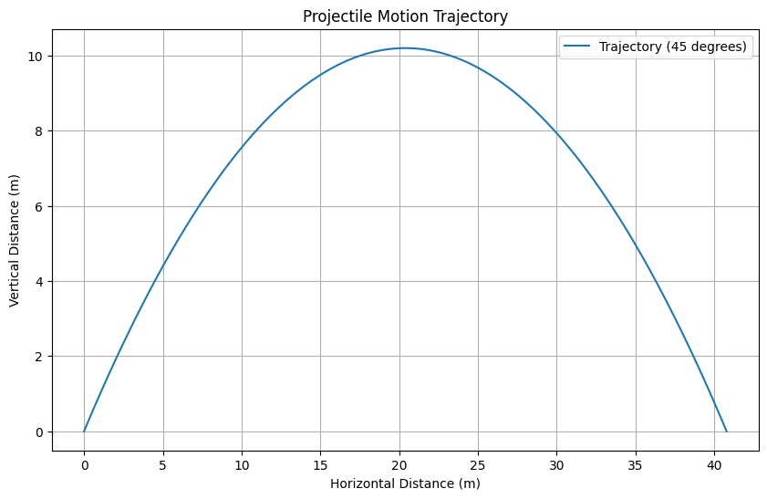
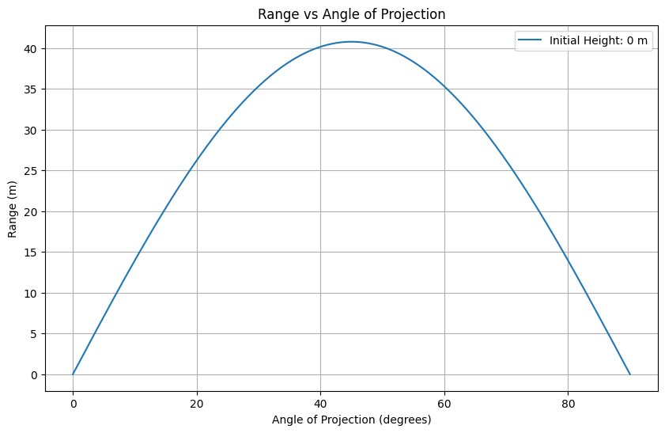

# Problem 1
---
# 1. Theoretical Foundation
---

### Projectile Motion Analysis

---

## 1.1 Motivation

Projectile motion, while seemingly simple, offers a rich playground for exploring fundamental principles of physics. The problem is straightforward: analyze how the range of a projectile depends on its angle of projection. 

Yet, beneath this simplicity lies a complex and versatile framework. The equations governing projectile motion involve both linear and quadratic relationships, making them accessible yet deeply insightful.

What makes this topic particularly compelling is the number of free parameters involved in these equations, such as initial velocity, gravitational acceleration, and launch height. 

These parameters give rise to a diverse set of solutions that can describe a wide array of real-world phenomena, from the arc of a soccer ball to the trajectory of a rocket.

---

## 1.2 Deliverables

1 . A Python script implementing the simulation of projectile motion.

2 . Detailed description of the family of solutions derived from the governing equations

3 . Graphs illustrating the trajectory and range as a function of the angle of projection.

4 . A discussion of the limitations and potential extensions of the idealized model, such as incorporating air resistance or uneven terrain.

---

## 1.3 Theoretical Foundation

---

### Governing Equations
The motion of a projectile can be described using the following kinematic equations:

1 . **Horizontal Motion:**
   $$ x(t) = v_0 \cos(\theta) t $$

2 . **Vertical Motion:**
   $$ y(t) = h + v_0 \sin(\theta) t - \frac{1}{2} g t^2 $$

Where:

- $x(t)$ and $y(t)$ are the horizontal and vertical positions at time $t$, respectively.

- $v_0$ is the initial velocity.

- $\theta$ is the angle of projection.

- $h$ is the initial height.

- $g$ is the acceleration due to gravity.

### Range Derivation
The horizontal range $R$ is the distance traveled by the projectile when it returns to the same vertical height as the launch point ($y = 0$).

For a projectile launched from ground level ($h = 0$):

1 . Solve for the time of flight $T$:
   $$ T = \frac{2 v_0 \sin(\theta)}{g} $$

2 . Calculate the range:

   $$ R = v_0 \cos(\theta) T $$


   $$ R = \frac{v_0^2 \sin(2\theta)}{g} $$

This equation shows that the range depends on the square of the initial velocity, the sine of twice the angle, and inversely on gravity.

---

# 2. Analysis of the Range
---

### Dependency on Angle

The range is maximized when $\sin(2\theta)$ is maximized, which occurs at $\theta = 45^\circ$.

### Effect of Other Parameters

- **Initial Velocity:** The range increases quadratically with $v_0$. 

- **Gravitational Acceleration:** The range decreases as $g$ increases.

- **Launch Height:** For $h > 0$, the time of flight is longer, increasing the range.

 ---

# 3. Practical Applications
---

### Real-World Scenarios
- **Uneven Terrain:** The landing point depends on the elevation difference.

- **Air Resistance:** Introduces drag force, reducing the range and altering the trajectory.

- **Sports:** Understanding ball trajectories in soccer, basketball, etc.

---

# 4. Implementation
---

### Python Simulation
Below is a Python script to simulate and visualize projectile motion:

```python
import numpy as np
import matplotlib.pyplot as plt

def projectile_motion(v0, theta, h, g=9.81):
    theta_rad = np.radians(theta)
    
    # Time of flight (quadratic formula for y=0)
    t_flight = (v0 * np.sin(theta_rad) + np.sqrt((v0 * np.sin(theta_rad))**2 + 2 * g * h)) / g
    
    # Time array
    t = np.linspace(0, t_flight, num=500)
    
    # Trajectory equations
    x = v0 * np.cos(theta_rad) * t
    y = h + v0 * np.sin(theta_rad) * t - 0.5 * g * t**2
    
    return x, y

def plot_range_vs_angle(v0, h, g=9.81):
    angles = np.linspace(0, 90, num=500)
    ranges = []

    for theta in angles:
        theta_rad = np.radians(theta)
        term = (v0 * np.sin(theta_rad))**2 + 2 * g * h
        t_flight = (v0 * np.sin(theta_rad) + np.sqrt(term)) / g
        R = v0 * np.cos(theta_rad) * t_flight
        ranges.append(R)

    plt.figure(figsize=(10, 6))
    plt.plot(angles, ranges, label=f"Initial Height: {h} m")
    plt.xlabel("Angle of Projection (degrees)")
    plt.ylabel("Range (m)")
    plt.title("Range vs Angle of Projection")
    plt.legend()
    plt.grid()
    plt.show()

# Example usage
v0 = 20  # Initial velocity in m/s
h = 0    # Launch height in meters

g = 9.81  # Gravitational acceleration

# Simulate trajectory
x, y = projectile_motion(v0, 45, h, g)

# Plot trajectory
plt.figure(figsize=(10, 6))
plt.plot(x, y, label="Trajectory (45 degrees)")
plt.xlabel("Horizontal Distance (m)")
plt.ylabel("Vertical Distance (m)")
plt.title("Projectile Motion Trajectory")
plt.legend()
plt.grid()
plt.show()

# Plot range vs angle
plot_range_vs_angle(v0, h, g)
```

 ---


 
 

---
# 5. Discussion

---

### Limitations

- **No Air Resistance:** Assumes a vacuum, leading to an overestimation of range.

- **Constant Gravity:** Neglects variations in gravitational acceleration with altitude.

- **Point Mass:** Ignores rotational effects or aerodynamic properties.

### Extensions

- Incorporate drag forces to model air resistance.

- Simulate projectile motion on non-level surfaces.

- Explore the effect of wind and spin on the projectile.
