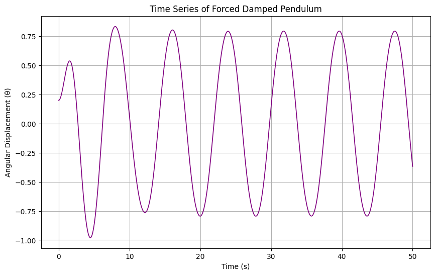
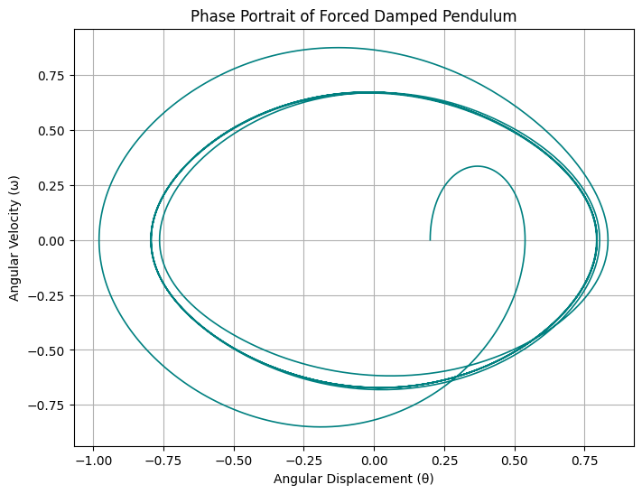
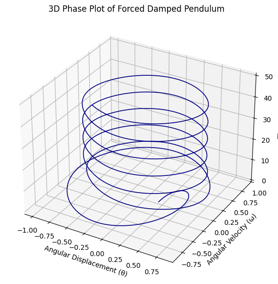

# Problem 2
---
# 1. Theoretical Foundation
---

### Investigating the Dynamics of a Forced Damped Pendulum
---

## 1.1 Motivation


The forced damped pendulum is a captivating example of a physical system with intricate behavior resulting from the interplay of damping, restoring forces, and external driving forces. 

By introducing both damping and external periodic forcing, the system demonstrates a transition from simple harmonic motion to a rich spectrum of dynamics, including resonance, chaos, and quasiperiodic behavior. 

These phenomena serve as a foundation for understanding complex real-world systems, such as driven oscillators, climate systems, and mechanical structures under periodic stress.

Adding forcing introduces new parameters, such as the amplitude and frequency of the external force, which significantly affect the pendulum's behavior. 

By systematically varying these parameters, a diverse class of solutions can be observed, including synchronized oscillations, chaotic motion, and resonance phenomena. 

These behaviors not only highlight fundamental physics principles but also provide insights into engineering applications such as energy harvesting, vibration isolation, and mechanical resonance.

---

## 1.2 Deliverables


1 . A Python script implementing the simulation of a forced damped pendulum.

2 . Graphs illustrating the behavior for various damping coefficients, driving amplitudes, and frequencies.

3 . Phase portraits, Poincaré sections, and bifurcation diagrams.

4 . Discussion of the model's limitations and potential extensions.

---

## 1.3 Theoretical Foundation
---

### Governing Equation

The motion of a forced damped pendulum is governed by the following nonlinear differential equation:

$$
\frac{d^2\theta}{dt^2} + \beta \frac{d\theta}{dt} + \omega_0^2 \sin(\theta) = A \cos(\omega t),
$$

where:

\- $\theta$: Angular displacement

\- $\beta$: Damping coefficient

\- $\omega_0$: Natural frequency of the pendulum

\- $A$: Amplitude of the external driving force

\- $\omega$: Driving frequency

### Small-Angle Approximation

For small angles ($\sin(\theta) \approx \theta$), the equation simplifies to:

$$
\frac{d^2\theta}{dt^2} + \beta \frac{d\theta}{dt} + \omega_0^2 \theta = A \cos(\omega t).
$$

Solutions in this regime can be analyzed to explore resonance conditions and the system's energy response.

### Resonance Conditions

Resonance occurs when the driving frequency $\omega$ matches the natural frequency $\omega_0$, resulting in maximum energy transfer and amplitude growth (limited by damping).

---

# 2. Analysis of Dynamics

---

### Parameter Influence

1 . **Damping Coefficient ($\beta$)**:

 \- High damping suppresses oscillations and prevents resonance.

 \- Low damping allows larger amplitudes and increases the likelihood of chaotic transitions.

2 . **Driving Amplitude ($A$)**:

 \- Larger amplitudes introduce stronger nonlinear effects and chaotic behavior.

3 . **Driving Frequency ($\omega$)**:

 \- Determines resonance and synchronization phenomena.

### Regular vs Chaotic Motion

1 . Chaotic motion arises as parameters transition through critical thresholds. 
     
2 . This can be visualized using tools like phase portraits and Poincaré sections.

---

# 3. Practical Applications
---

### Real-World Scenarios

\- **Energy Harvesting Devices:** Optimize oscillations for maximum energy extraction.

\- **Suspension Bridges:** Analyze and mitigate resonance-induced failures.

\- **Oscillating Circuits:** Model electrical analogs of forced damped systems.

---

# 4. Implementation

---

### Python Simulation
Below is a Python script to simulate and visualize the motion of a forced damped pendulum:

```python
import numpy as np
import matplotlib.pyplot as plt
from mpl_toolkits.mplot3d import Axes3D
from scipy.integrate import solve_ivp

  # Computing the derivatives for the forced damped pendulum.
def forced_damped_pendulum(t, y, beta, omega_0, A, omega):

    theta, omega_theta = y
    dtheta_dt = omega_theta
    domega_dt = -beta * omega_theta - omega_0**2 * np.sin(theta) + A * np.cos(omega * t)
    return [dtheta_dt, domega_dt]

   # Simulates the forced damped pendulum.
def simulate_pendulum(beta, omega_0, A, omega, theta0, omega_theta0, t_span, t_eval):
 
    y0 = [theta0, omega_theta0]
    sol = solve_ivp(forced_damped_pendulum, t_span, y0, t_eval=t_eval, args=(beta, omega_0, A, omega))
    if not sol.success:
        raise RuntimeError("ODE solver failed.")
    return sol.t, sol.y

  # Plot of the phase portrait of the pendulum.
def plot_phase_portrait(theta, omega_theta):
   
    plt.figure(figsize=(8, 6))
    plt.plot(theta, omega_theta, color="teal", lw=1.2)
    plt.xlabel("Angular Displacement (θ)")
    plt.ylabel("Angular Velocity (ω)")
    plt.title("Phase Portrait of Forced Damped Pendulum")
    plt.grid()
    plt.show()

  # Plots the time series of angular displacement.
def plot_time_series(t, theta):
   
    plt.figure(figsize=(10, 6))
    plt.plot(t, theta, color="purple", lw=1.2)
    plt.xlabel("Time (s)")
    plt.ylabel("Angular Displacement (θ)")
    plt.title("Time Series of Forced Damped Pendulum")
    plt.grid()
    plt.show()

    # 3D Plot of phase with time as the third axis.
def plot_3d_phase(t, theta, omega_theta):
   
    fig = plt.figure(figsize=(10, 7))
    ax = fig.add_subplot(111, projection='3d')
    ax.plot(theta, omega_theta, t, color="navy", lw=1.2)
    ax.set_xlabel("Angular Displacement (θ)")
    ax.set_ylabel("Angular Velocity (ω)")
    ax.set_zlabel("Time (s)")
    ax.set_title("3D Phase Plot of Forced Damped Pendulum")
    plt.show()

# Parameters
params = {
    "beta": 0.5,       # Damping coefficient
    "omega_0": 1.5,    # Natural frequency
    "A": 1.2,          # Driving amplitude
    "omega": 0.8,      # Driving frequency
    "theta0": 0.2,     # Initial displacement (radians)
    "omega_theta0": 0, # Initial angular velocity
    "t_span": (0, 50), # Time span for simulation
    "t_eval": np.linspace(0, 50, 2000) # Time points for evaluation
}

# Simulate
t, y = simulate_pendulum(**params)
theta, omega_theta = y

# Visualize
plot_time_series(t, theta)
plot_phase_portrait(theta, omega_theta)
plot_3d_phase(t, theta, omega_theta)

```




---

# 5. Discussion

---

### Limitations

\- **Small-Angle Assumption:** Only valid for $\theta \ll 1$ radians.

\- **Idealized Driving Force:** Assumes a perfectly periodic external force.

\- **Linear Damping:** Real-world damping may be nonlinear.

### Extensions

\- **Nonlinear Damping:** Incorporate velocity-dependent damping terms.

\- **Non-Periodic Forcing:** Explore the effects of stochastic or quasiperiodic driving forces.

\- **Coupled Pendulums:** Investigate interactions between multiple driven pendulums.

---

This analysis showcases the fascinating dynamics of forced damped pendulums and provides a foundation for exploring real-world applications and complex behaviors.
