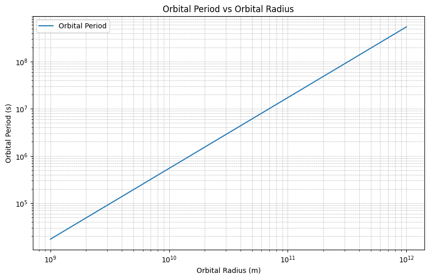
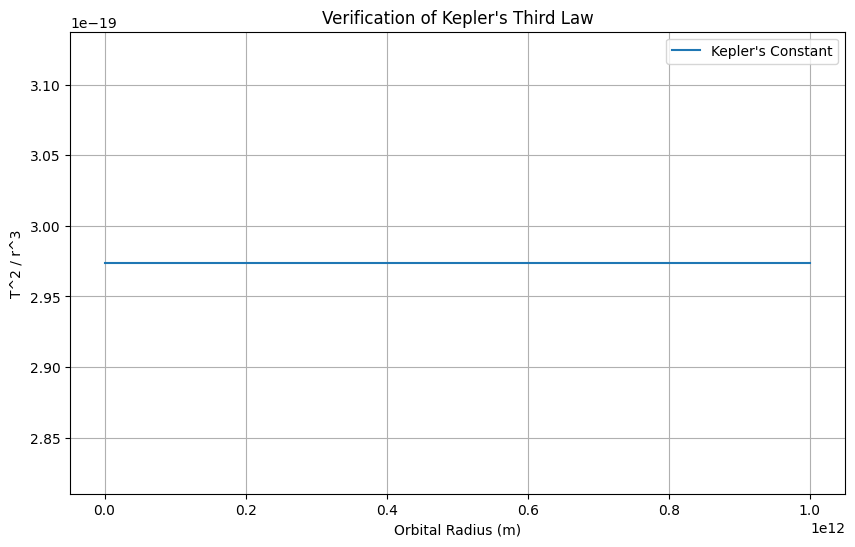

# Problem 1
---
# Orbital Period and Orbital Radius
---
## 1.1 Motivation
Kepler's Third Law, which relates the square of the orbital period to the cube of the orbital radius for celestial bodies, is a foundational principle in celestial mechanics. 

This elegant relationship not only underpins our understanding of planetary motion but also provides a crucial tool for determining masses and distances within planetary systems. 

From calculating the properties of satellite orbits to probing the dynamics of exoplanetary systems, Kepler's Third Law is indispensable.

---

## 1.2 Deliverables
1 . **Markdown Document:** Explanation of Kepler's Third Law and its derivation.

2 . **Python Script:** Computational model for circular orbits.

3 . **Graphical Representations:**

 - Log-log plot of orbital period vs radius.
 
 - Verification plot of Kepler's constant.

---

## 1.3 Theoretical Foundation

---

### Derivation of Kepler's Third Law
Consider a celestial body of mass \( m \) orbiting a central body of mass \( M \) in a circular orbit of radius \( r \). The centripetal force required for the orbit is provided by gravitational attraction:

$$
F = \frac{G M m}{r^2}
$$

where:
- $\( G \)$ is the gravitational constant,
- $\( M \)$ is the mass of the central body,
- $\( m \)$ is the mass of the orbiting body,
- $\( r \)$ is the orbital radius.

The centripetal force is also expressed as:

$$
F = \frac{m v^2}{r}
$$

Equating these two expressions:

$$
\frac{G M m}{r^2} = \frac{m v^2}{r}
$$

Simplify to solve for $\( v \)$:

$$
v^2 = \frac{G M}{r}
$$

The orbital period $\( T \)$ is related to the orbital velocity $\( v \)$ and radius $\( r \)$ by:

$$
T = \frac{2 \pi r}{v}
$$

Substitute $\( v = \sqrt{\frac{G M}{r}} \)$:

$$
T = \frac{2 \pi r}{\sqrt{\frac{G M}{r}}} = 2 \pi \sqrt{\frac{r^3}{G M}}
$$

Squaring both sides yields Kepler's Third Law:

$$
T^2 = \frac{4 \pi^2}{G M} r^3
$$

---

## 2. Implications for Astronomy

---

### Applications
1 . **Planetary Masses:** By observing orbital periods and radii, one can deduce the mass of the central body (e.g., the Sun or Earth).

2 . **Distance Measurement:** Kepler's Law aids in determining distances between celestial bodies, which is crucial for mapping planetary systems.

### Examples

- **The Moon's Orbit:** Using the Moon's orbital period and radius, one can calculate Earth's mass.

- **Planetary Orbits:** Applying Kepler's Third Law to the Solar System planets provides accurate orbital properties.

---

## 3. Computational Implementation

---

### Python Simulation
Below is a Python script to simulate circular orbits and verify Kepler's Third Law:

```python
import numpy as np
import matplotlib.pyplot as plt

# Gravitational constant (m^3 kg^-1 s^-2)
G = 6.67430e-11

# Mass of the central body (e.g., Sun in kg)
M = 1.989e30

# Orbital radii (meters)
orbits = np.logspace(9, 12, num=100)  # Range of orbital radii

# Compute orbital periods (seconds)
periods = 2 * np.pi * np.sqrt(orbits**3 / (G * M))

# Verify Kepler's Third Law (T^2 / r^3 = constant)
kepler_constant = periods**2 / orbits**3

# Plot orbital period vs orbital radius
plt.figure(figsize=(10, 6))
plt.loglog(orbits, periods, label="Orbital Period")
plt.xlabel("Orbital Radius (m)")
plt.ylabel("Orbital Period (s)")
plt.title("Orbital Period vs Orbital Radius")
plt.grid(True, which="both", linestyle="--", linewidth=0.5)
plt.legend()
plt.show()

# Plot Kepler's constant to check consistency
plt.figure(figsize=(10, 6))
plt.plot(orbits, kepler_constant, label="Kepler's Constant")
plt.xlabel("Orbital Radius (m)")
plt.ylabel("T^2 / r^3")
plt.title("Verification of Kepler's Third Law")
plt.grid(True)
plt.legend()
plt.show()
```




---

## 4. Discussion
---

### Extensions
- **Elliptical Orbits:** Kepler's Third Law can be generalized for elliptical orbits by replacing \( r \) with the semi-major axis.
- **Non-Point Masses:** Considerations for binary systems or extended mass distributions.

### Limitations
- **Simplifications:** Assumes circular orbits and point masses.
- **Perturbations:** Neglects gravitational influences from other bodies or relativistic effects.

By combining theoretical insights with computational tools, the profound simplicity and utility of Kepler's Third Law can be effectively explored and applied to celestial mechanics.

