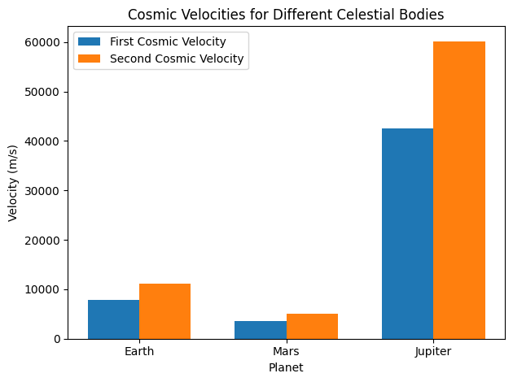

# Problem 2
---
# Escape Velocities and Cosmic Velocities
---
## 1.1 Motivation
The concept of escape velocity is fundamental in astrophysics and space exploration. 

It defines the minimum speed an object must reach to overcome the gravitational influence of a celestial body without additional propulsion. 

Extending this concept further, the first, second, and third cosmic velocities describe the thresholds for orbiting a planet, escaping a planet's gravitational pull, and escaping a star system, respectively. 

These concepts are critical in designing satellite launches, interplanetary missions, and potential interstellar travel.

---

## 1.2 Deliverables

1 . **Markdown Document**: Detailed explanation of escape and cosmic velocities.

2 . **Python Script**: Computational model to calculate and visualize the velocities.

3 . **Graphical Representations**:

 - Bar chart comparing first and second cosmic velocities for Earth, Mars, and Jupiter.

---

## 1.3 Theoretical Foundation

---
###  Definitions and Physical Meanings

1. **First Cosmic Velocity**: The velocity required for an object to maintain a stable circular orbit around a celestial body.
   
    $$v_1 = \sqrt{\frac{G M}{r}}$$
   
   Where:

   \- $(G)$: Gravitational constant

   \- $(M)$: Mass of the celestial body

   \- $(r)$: Radius of the orbit (distance from the center of the body)

2 . **Second Cosmic Velocity (Escape Velocity)**: The velocity required to escape the gravitational field of a celestial body.

   $$ v_2 = \sqrt{2} v_1 = \sqrt{\frac{2 G M}{r}} $$

3 . **Third Cosmic Velocity**: The velocity required to escape the gravitational influence of a star system.
   
   $$ v_3 = \sqrt{v_2^2 + \frac{2 G M_{\text{star}}}{r}} $$
   
   Where $M_{\text{star}}$ is the mass of the central star.

---

## 2. Mathematical Analysis

### Parameters Influencing Cosmic Velocities
\- **Mass $( M )$**: Higher mass increases the gravitational pull, raising all three velocities.

\- **Radius $( r )$**: Greater distances from the center of the celestial body reduce the gravitational force, lowering the velocities.

\- **Gravitational Constant $( G )$**: A universal constant influencing the strength of gravity.

### Calculations for Earth, Mars, and Jupiter

#### Example Values:
\- **Earth**: $( M = 5.972 \times 10^{24} \ \text{kg}, r = 6.371 \times 10^{6} \ \text{m} )$

\- **Mars**: $( M = 6.39 \times 10^{23} \ \text{kg}, r = 3.39 \times 10^{6} \ \text{m} )$

\- **Jupiter**: $( M = 1.898 \times 10^{27} \ \text{kg}, r = 6.99 \times 10^{7} \ \text{m} )$

---

## 3. Computational Implementation

---

### Python Script
```python
import numpy as np
import matplotlib.pyplot as plt

# Gravitational constant (m^3 kg^-1 s^-2)
G = 6.67430e-11

# Define celestial bodies
data = {
    "Earth": {"mass": 5.972e24, "radius": 6.371e6},
    "Mars": {"mass": 6.39e23, "radius": 3.39e6},
    "Jupiter": {"mass": 1.898e27, "radius": 6.99e7},
}

# Calculate velocities
results = {}
for planet, values in data.items():
    mass = values["mass"]
    radius = values["radius"]
    v1 = np.sqrt(G * mass / radius)  # First cosmic velocity
    v2 = np.sqrt(2) * v1            # Second cosmic velocity
    results[planet] = {"v1": v1, "v2": v2}

# Display results
for planet, velocities in results.items():
    print(f"{planet}: First Cosmic Velocity = {velocities['v1']:.2f} m/s, Second Cosmic Velocity = {velocities['v2']:.2f} m/s")

# Visualization
labels = list(results.keys())
v1_values = [results[planet]["v1"] for planet in labels]
v2_values = [results[planet]["v2"] for planet in labels]

x = np.arange(len(labels))
width = 0.35

fig, ax = plt.subplots()
bar1 = ax.bar(x - width/2, v1_values, width, label="First Cosmic Velocity")
bar2 = ax.bar(x + width/2, v2_values, width, label="Second Cosmic Velocity")

ax.set_xlabel("Planet")
ax.set_ylabel("Velocity (m/s)")
ax.set_title("Cosmic Velocities for Different Celestial Bodies")
ax.set_xticks(x)
ax.set_xticklabels(labels)
ax.legend()

plt.tight_layout()
plt.show()
```


---

## 4. Discussion

--- 

### Importance in Space Exploration

 \- **Launching Satellites**: The first cosmic velocity determines the minimum speed required for satellites to orbit Earth.

 \- **Interplanetary Missions**: The second cosmic velocity is critical for missions escaping Earth's gravitational pull, such as journeys to Mars.

 \- **Interstellar Travel**: The third cosmic velocity underpins the feasibility of missions beyond our solar system.

### Limitations and Extensions

\- **Simplifications**: Assumes point masses and neglects factors like atmospheric drag or relativistic effects.

\- **Extensions**: Explore scenarios with varying atmospheric densities or gravitational influences from multiple bodies.

Understanding cosmic velocities is not only a theoretical exercise but also a practical necessity in advancing humanity's reach into space. 

This framework forms the foundation for the precise calculations required in modern space exploration.

