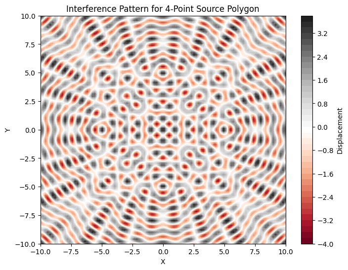

# Problem 1

# Interference Patterns on a Water Surface

## Motivation

Interference occurs when waves from different sources overlap, creating new patterns. 

On a water surface, this can be observed when ripples from different points meet, forming distinctive interference patterns. 

These patterns help us understand wave behavior, the relationship between wave phase, and the effects of multiple sources. 

Studying interference is both an intuitive and practical way to learn about wave physics.

---

## Problem Statement

Analyze the interference patterns formed on the water surface due to the superposition of waves emitted from point sources positioned at the vertices of a chosen regular polygon.

## Deliverables

1 . Markdown Document: Explaining interference and implementation.

2 . Python Script/Notebook: Code to simulate interference patterns.

3 . Graphical Visualizations: Contour plots for different polygon configurations.

4 . Analysis: Discussion of how polygon geometry affects interference patterns.

### Single Wave Equation:
A circular wave on a water surface, emanating from a point source located at $r_i$, is described by:
$$
\eta(r, t) = A \cos(k r - \omega t + \phi) 
$$

Where:
\- $\eta(r, t)$: Displacement of the water surface at point $r$ and time $t$.

\- $A$: Amplitude of the wave.

\- $k$: Wave number $(k = \frac{2\pi}{\lambda})$.

\- $\omega$: Angular frequency $(\omega = 2\pi f)$.

\- $r$: Distance from the source to the point.

\- $\phi$: Initial phase.

### Superposition Principle:
For $N$ sources placed at positions $r_i$, the total displacement is:
$$
\eta_{\text{total}}(r, t) = \sum_{i=1}^{N} A \cos(k |r - r_i| - \omega t + \phi) 
$$

### Task Objectives:
1 . **Select a Regular Polygon**: Place wave sources at its vertices.

2 . **Position the Sources**: Use geometry to calculate vertex positions.

3 . **Wave Equations**: Define the displacement for each source.

4 . **Superposition**: Sum displacements from all sources.

5 . **Analyze Patterns**: Identify regions of constructive and destructive interference.

6 . **Visualize**: Create plots showing interference patterns.

---

## Steps

### Step 1: Select a Regular Polygon
\- Choose a regular polygon (e.g., equilateral triangle, square, pentagon). 

\- Vertices represent the wave source positions.

### Step 2: Position the Sources
Calculate vertex positions using polar coordinates:

$$ r_i = R \cdot e^{i \frac{2\pi i}{n}} $$

\- $R$: Radius of the polygon.

\- $n$: Number of vertices (sources).

\- $i$: Vertex index.

### Step 3: Write the Wave Equations
For a source at $r_i$:
$$
\eta_i(r, t) = A \cos(k |r - r_i| - \omega t + \phi) 
$$

### Step 4: Apply Superposition of Waves
Combine the displacements of all sources:
$$
\eta_{\text{total}}(r, t) = \sum_{i=1}^{N} \eta_i(r, t) 
$$

### Step 5: Analyze the Patterns
Visualize regions of:

\- **Constructive interference**: Waves reinforce each other.

\- **Destructive interference**: Waves cancel each other out.

### Step 6: Visualization
Generate contour plots showing the interference patterns for different polygon configurations.

---

## Implementation in Python

```python
import numpy as np
import matplotlib.pyplot as plt

# Constants
A = 1       # Amplitude
k = 2 * np.pi / 1  # Wave number (assuming wavelength = 1)
omega = 2 * np.pi * 1  # Angular frequency (assuming frequency = 1)
R = 5       # Radius of the polygon
n = 4       # Number of sources (vertices of polygon, e.g., square)

def wave_displacement(r, r_i, A, k, omega, t, phi):
    distance = np.linalg.norm(r - r_i)
    return A * np.cos(k * distance - omega * t + phi)

def polygon_sources(R, n):
    angles = np.linspace(0, 2 * np.pi, n, endpoint=False)
    return np.array([(R * np.cos(angle), R * np.sin(angle)) for angle in angles])

# Create grid points
x_vals = np.linspace(-10, 10, 100)
y_vals = np.linspace(-10, 10, 100)
X, Y = np.meshgrid(x_vals, y_vals)
points = np.vstack([X.ravel(), Y.ravel()]).T

# Source positions
sources = polygon_sources(R, n)

t = 0  # Time
displacement = np.zeros(points.shape[0])

for i, point in enumerate(points):
    displacement_at_point = 0
    for source in sources:
        displacement_at_point += wave_displacement(point, source, A, k, omega, t, 0)
    displacement[i] = displacement_at_point

Z = displacement.reshape(X.shape)

# Plot interference pattern
plt.figure(figsize=(8, 6))
plt.contourf(X, Y, Z, 50, cmap='RdGy')
plt.colorbar(label='Displacement')
plt.title(f'Interference Pattern for {n}-Point Source Polygon')
plt.xlabel('X')
plt.ylabel('Y')
plt.show()
```

---



## Explanation of the Code

\- **Wave_displacement**: This function computes the displacement at a given point $𝑟$ due to a wave source at $𝑟_i$,using the wave equation.

\- **Polygon_sources**: This function calculates the positions of the wave sources placed at the vertices of a regular polygon.

\- **Superposition**: For each point on the grid, we sum the displacements due to all wave sources to get the total displacement.

\- **Visualization**: The displacement values are plotted using contour plots to show regions of constructive and destructive interference.