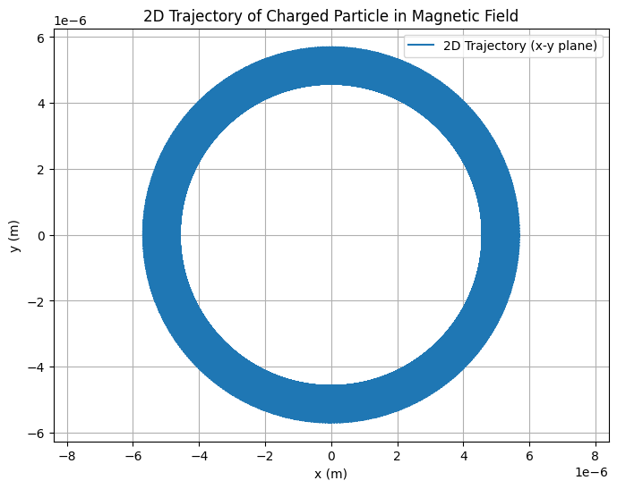
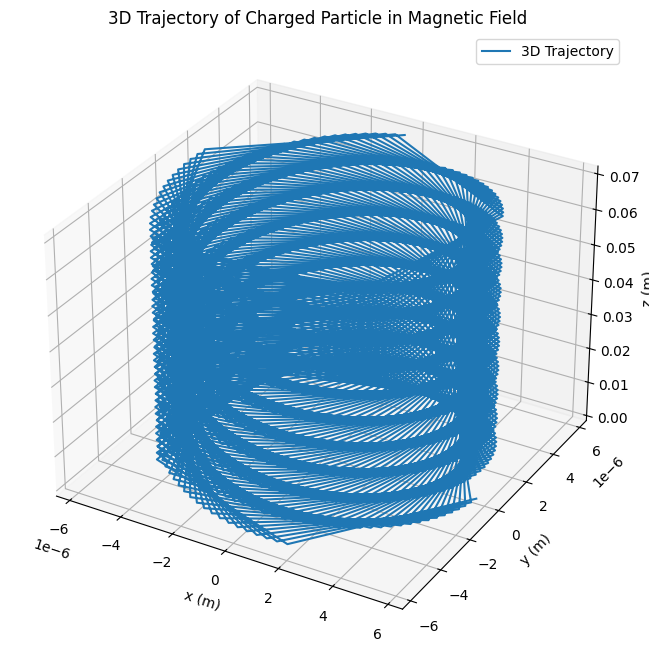

# Problem 1

# Simulating the Effects of the Lorentz Force

## Motivation
The Lorentz force, expressed as:
$$
\vec{F} = q(\vec{E} + \vec{v} \times \vec{B})
$$
governs the motion of charged particles in electric ($\vec{E}$) and magnetic ($\vec{B}$) fields. 

This fundamental principle is pivotal in plasma physics, particle accelerators, and astrophysics. 


By simulating these effects, we can explore practical applications and visualize complex trajectories of charged particles.

---
## Deliverables
1 . **Markdown Document**: Explaining the task and methodology.

2 . **Python Script/Notebook**: Implementation of the simulations.

3 . **Visualizations**:

\- Particle trajectories for specified field configurations.
 
\- 2D and 3D plots highlighting key physical phenomena.

4 . **Discussion**:

\- Relate results to practical systems like cyclotrons and magnetic traps.

\- Provide suggestions for extending the simulation to non-uniform fields.

## Tasks

### 1. Exploration of Applications
1 . **Identify Systems**:

   \- Particle accelerators.
 
   \- Mass spectrometers.
   
   \- Plasma confinement systems.

2 . **Discuss Field Relevance**:
   
   \- Analyze how electric ($\vec{E}$) and magnetic ($\vec{B}$) fields control particle motion.

### 2. Simulating Particle Motion
Simulate the trajectory of a charged particle under various field conditions:

1 . **Uniform Magnetic Field**: Visualize circular motion.

2 . **Combined Uniform Electric and Magnetic Fields**: Analyze helical motion.

3 . **Crossed Fields**: Examine drift motion.

### 3. Parameter Exploration
1 . **Field Strength Variations**: Adjust $\vec{E}$ and $\vec{B}$.

2 . **Initial Velocity**: Explore different values for $\vec{v}_0$.

3 . **Particle Properties**:
   - Charge $q$.
   - Mass $m$.

### 4. Visualization
1 . Generate clear, labeled 2D and 3D plots.

2 . Highlight key phenomena like:

   \- Larmor radius.

   \- Drift velocity.

3 . Provide detailed explanations of the plots, emphasizing:

  \- How the trajectory corresponds to physical principles.

  \- The effect of different parameters (e.g., field strength, particle velocity) on the motion.

  \- Differences in trajectories under various configurations (uniform $\vec{B}$, combined $\vec{E}$ and $\vec{B}$, crossed fields).

---

## Implementation in Python

### Numerical Methods

\- Use **Euler** or **Runge-Kutta** methods to solve equations of motion.

\- Employ libraries like **NumPy** for calculations and **Matplotlib** for visualization.

### Example Simulation (Uniform Magnetic Field)

```python
import numpy as np
import matplotlib.pyplot as plt
from mpl_toolkits.mplot3d import Axes3D

# Constants
eq = 1.6e-19  # Charge of the particle (C)
mass = 9.11e-31  # Mass of the particle (kg)
B = 1.0  # Magnetic field strength (T)

# Initial conditions
v0 = 1e6  # Initial velocity (m/s)
angle = np.pi / 4  # Angle of initial velocity with respect to the z-axis

# Derived quantities
omega = eq * B / mass  # Cyclotron frequency
radius = mass * v0 / (eq * B)  # Radius of circular motion

# Time parameters
time = np.linspace(0, 1e-7, 1000)  # Time array

# 2D Trajectory (in x-y plane)
x_2d = radius * np.cos(omega * time)
y_2d = radius * np.sin(omega * time)

# 3D Trajectory (with initial velocity at an angle to the z-axis)
vz = v0 * np.cos(angle)  # Z-component of velocity
vr = v0 * np.sin(angle)  # Radial velocity in the x-y plane

z_3d = vz * time  # Uniform motion along z-axis
x_3d = radius * np.cos(omega * time)
y_3d = radius * np.sin(omega * time)

# Plotting the 2D Trajectory
plt.figure(figsize=(8, 6))
plt.plot(x_2d, y_2d, label="2D Trajectory (x-y plane)")
plt.xlabel("x (m)")
plt.ylabel("y (m)")
plt.title("2D Trajectory of Charged Particle in Magnetic Field")
plt.grid()
plt.axis("equal")
plt.legend()
plt.show()

# Plotting the 3D Trajectory
fig = plt.figure(figsize=(10, 8))
ax = fig.add_subplot(111, projection='3d')
ax.plot(x_3d, y_3d, z_3d, label="3D Trajectory")
ax.set_xlabel("x (m)")
ax.set_ylabel("y (m)")
ax.set_zlabel("z (m)")
ax.set_title("3D Trajectory of Charged Particle in Magnetic Field")
ax.legend()
plt.show()
```



### Explanation of Visualization
\- The 3D plot demonstrates the trajectory of a charged particle in a uniform magnetic field.

\- **Circular motion** is observed due to the Lorentz force acting perpendicular to the particle's velocity, creating a centripetal force.

\- The **radius of the trajectory (Larmor radius)** depends on the particle's mass, charge, velocity, and the magnetic field strength.

\- Variations in initial conditions or field parameters would alter the shape and size of the trajectory, which can be explored by modifying the simulation parameters.

---

