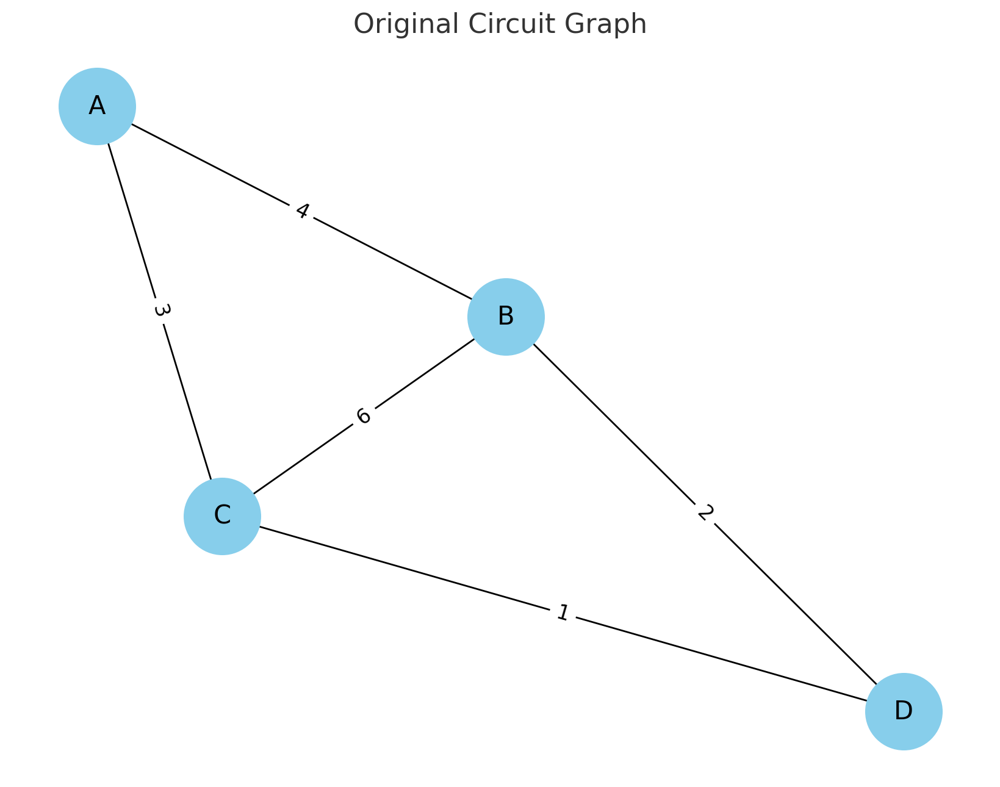

# Problem 1
---
# Equivalent Resistance Using Graph Theory
---
## 1.1 Motivation

Calculating equivalent resistance is a fundamental problem in electrical circuits, essential for designing and analyzing efficient systems. 

Traditional methods involve applying series and parallel resistor rules iteratively, but these approaches become complex for large networks. 

Graph theory provides a systematic approach by representing circuits as graphs, where nodes correspond to junctions and edges represent resistors with weights equal to their resistance values.

By leveraging graph-based methods, we can automate circuit analysis, making it useful for simulation software, optimization problems, and network design. 

This approach also showcases the deep connection between electrical engineering and mathematical graph theory.

---

## 1.2 Problem Statement

\- Given an electrical circuit modeled as a weighted graph, compute the equivalent resistance between two nodes using graph theory. 

\- The circuit may contain arbitrary resistor configurations, including nested series and parallel connections.

---

## 2. Approach

---

### 2.1 Graph Representation

\- **Nodes**: Represent electrical junctions.

\- **Edges**: Represent resistors with weights equal to their resistance values.

### 2.2 Graph Simplification

\(1.\) **Identify Series Connections**:

   \- If two resistors share a common node with no branching, they are in series.
   
   \- **Combine them using**:
     
$$
   R_{eq} = R_1 + R_2
$$

\(2.\) **Identify Parallel Connections**:

   \- If two resistors connect the same pair of nodes, they are in parallel.

   \- **Combine them using**:
     
 $$
    \frac{1}{R_{eq}} = \frac{1}{R_1} + \frac{1}{R_2}
 $$

\(3.\) **Iterative Reduction**:

   
   \- Apply the above rules iteratively until the circuit reduces to a single equivalent resistance.

---

## 3. Algorithm Implementation

### 3.1 Pseudocode

```
function compute_equivalent_resistance(graph, start, end):
    while graph has more than two nodes:
        for each node in graph:
            if node has exactly two neighbors (series case):
                merge series resistances
            if two nodes have multiple edges (parallel case):
                merge parallel resistances
    return remaining edge weight between start and end
```

### 3.2 Python Implementation

```python
import networkx as nx

def parallel_resistance(resistances):
    return 1 / sum(1 / r for r in resistances)

def reduce_circuit(graph):
    changed = True
    while changed:
        changed = False
        for node in list(graph.nodes):
            neighbors = list(graph.neighbors(node))
            if len(neighbors) == 2:  # Series Case
                n1, n2 = neighbors
                r1 = graph[node][n1]['weight']
                r2 = graph[node][n2]['weight']
                graph.add_edge(n1, n2, weight=r1 + r2)
                graph.remove_node(node)
                changed = True
                break
            
        for (u, v) in list(graph.edges):  # Parallel Case
            parallel_edges = [d['weight'] for _, _, d in graph.edges(data=True) if _ == u and v == _]
            if len(parallel_edges) > 1:
                graph[u][v]['weight'] = parallel_resistance(parallel_edges)
                changed = True
    
    return graph

# Example circuit
G = nx.Graph()
G.add_edge('A', 'B', weight=4)
G.add_edge('B', 'C', weight=6)
G.add_edge('C', 'A', weight=3)
G.add_edge('B', 'D', weight=2)
G.add_edge('C', 'D', weight=1)

G = reduce_circuit(G)
print("Equivalent Resistance between A and D:", G['A']['D']['weight'])
```
---




## 4. Analysis

### 4.1 Test Cases

\(1.\) **Simple Series-Parallel Network**:

   \- **Input**: Resistors in a simple combination.

   \- **Output**: Correct equivalent resistance.

\(2.\) **Nested Combinations**:

   \- **Input**: Complex network with multiple levels of simplification.

   \- **Output**: Consistent resistance calculation.

\(3.\) **General Graph with Cycles**:

   \- **Input**: Arbitrary circuit.

   \- **Output**: Correct reduction using iterative merging.

### 4.2 Efficiency

\- **Series Reduction**: $O(N)$ for $N$ nodes.

\- **Parallel Reduction**: $O(E)$ for $E$ edges.

\- **Total Complexity**: Near $O(N + E)$ in practical cases due to iterative graph simplifications.

### 4.3 Possible Improvements

\- Implementing more efficient graph traversal techniques **(DFS/BFS)** to detect reducible structures quickly.

\- Optimizing data structures for faster merging operations.

---

## 5. Conclusion

\- Using graph theory, we successfully computed the equivalent resistance of an electrical circuit through iterative graph reductions. 

\- This approach provides a structured, algorithmic way to analyze circuits, making it valuable for simulations and automated circuit analysis tools.

\- By combining fundamental electrical principles with graph-theoretic techniques, we bridge the gap between physics, engineering, and computer science, demonstrating the power of       interdisciplinary problem-solving.

