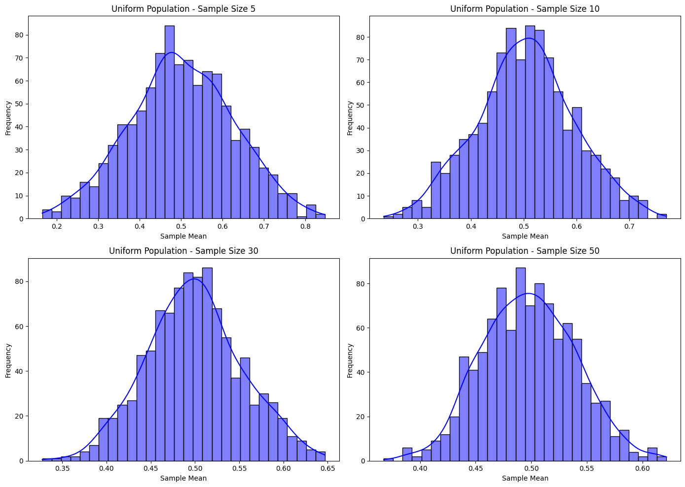

# Problem 1

# Exploring the Central Limit Theorem through Simulations

## Motivation
The Central Limit Theorem (CLT) is a cornerstone of probability and statistics. It states that the sampling distribution of the sample mean approaches a normal distribution as the sample size increases, regardless of the population’s original distribution. Simulations provide an intuitive and hands-on way to observe this phenomenon in action.

## Deliverables

\- **A Markdown document** and Python scripts or notebooks implementing the simulations for various population distributions.

\- **Plots** illustrating the sampling distributions and their progression toward normality.

\- **A discussion** on the implications of the results and their connection to theoretical expectations.

## Task

### 1. Simulating Sampling Distributions

\- **Select several types of population distributions**, such as:
  
  \- Uniform distribution.
  
  \- Exponential distribution.
  
  \- Binomial distribution.

\- For each distribution, generate a large dataset representing the population.

### 2. Sampling and Visualization

\- Randomly sample data from the population and calculate the sample mean for different sample sizes (e.g., 5, 10, 30, 50).

\- Repeat the process multiple times to create a sampling distribution of the sample mean.

\- Plot histograms of the sample means for each sample size and observe the convergence to a normal distribution.

### 3. Parameter Exploration

\- **Investigate how the shape of the original distribution and the sample size influence the rate of convergence to normality.**

\- Highlight the impact of the population’s variance on the spread of the sampling distribution.

### 4. Practical Applications

Reflect on the importance of the CLT in real-world scenarios, such as:

\- Estimating population parameters.

\- Quality control in manufacturing.

\- Predicting outcomes in financial models.


## Python Implementation
```python
import numpy as np
import matplotlib.pyplot as plt
import seaborn as sns

# Function to simulate sampling distribution
def simulate_clt(population, sample_size, num_samples):
    sample_means = []
    for _ in range(num_samples):
        sample = np.random.choice(population, size=sample_size, replace=True)
        sample_means.append(np.mean(sample))
    return sample_means

# Parameters
np.random.seed(42)  
population_size = 100000
num_samples = 1000

# Population distributions
uniform_population = np.random.uniform(0, 1, population_size)
exponential_population = np.random.exponential(1, population_size)

# Sampling parameters
sample_sizes = [5, 10, 30, 50]

# Visualization
for population, label in zip([uniform_population, exponential_population], ["Uniform", "Exponential"]):
    plt.figure(figsize=(14, 10))
    for i, sample_size in enumerate(sample_sizes, 1):
        sample_means = simulate_clt(population, sample_size, num_samples)
        plt.subplot(2, 2, i)
        sns.histplot(sample_means, kde=True, bins=30, color="blue")
        plt.title(f"{label} Population - Sample Size {sample_size}")
        plt.xlabel("Sample Mean")
        plt.ylabel("Frequency")
    plt.tight_layout()
    plt.show()
```



## Summary

This task encourages students to explore the Central Limit Theorem through computational experiments, deepening their understanding of its significance in statistics. 

The simulations and visualizations provide a clear and interactive way to see the CLT in action and its implications in practical applications.


