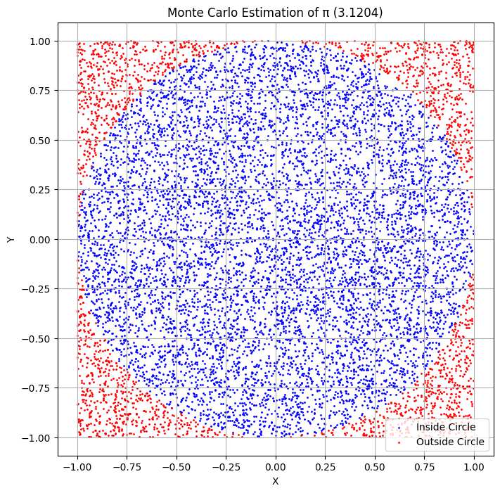
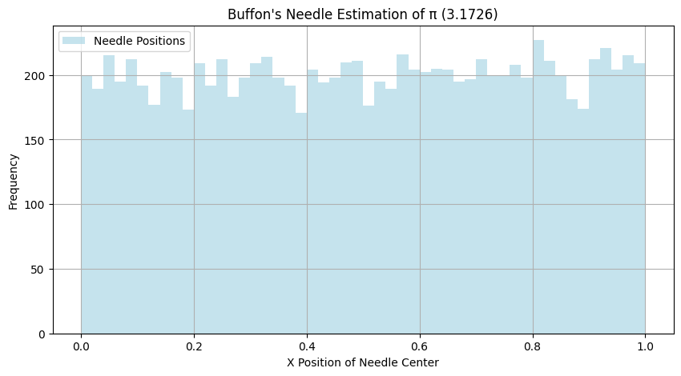

# Problem 2

# Estimating Pi Using Monte Carlo Methods

## Motivation
Monte Carlo simulations are a powerful class of computational techniques that use randomness to solve problems or estimate values. One of the most elegant applications of Monte Carlo methods is estimating the value of π through geometric probability. By randomly generating points and analyzing their positions relative to a geometric shape, we can approximate π in an intuitive and visually engaging way.

This problem connects fundamental concepts of probability, geometry, and numerical computation. It also provides a gateway to understanding how randomness can be harnessed to solve complex problems in physics, finance, and computer science. The Monte Carlo approach to π estimation highlights the versatility and simplicity of this method while offering practical insights into convergence rates and computational efficiency.

---


## Deliverables

### Markdown Document
\- Clear explanations of the methods and formulas.

\- A discussion of theoretical foundations and results.

### Python Scripts
\- Code for the circle-based Monte Carlo method.

\- Code for the Buffon’s Needle method.

### Graphical Outputs
\- Plots showing random points for the circle-based method.

\- Visualizations of needle positions for Buffon’s Needle.

### Analysis
\- Tables or graphs showing the convergence of estimated π as a function of the number of iterations for both methods.

\- A comparison of the methods in terms of accuracy and computational efficiency.

---

## Part 1: Estimating π Using a Circle

### Theoretical Foundation
\(1.\) The ratio of points inside a circle to the total number of points in a square can be used to estimate π.

\(2.\) For a unit circle $(radius = 1)$, the formula for π is derived using the area of the circle $(πr²)$ and the area of the bounding square $(4r²)$.

\(3.\) By randomly generating points within the square, we count the number that falls inside the circle and use the ratio to approximate π.

### Simulation
Below is the Python implementation of the circle-based Monte Carlo method:

```python
import numpy as np
import matplotlib.pyplot as plt

def estimate_pi_circle(num_points):
    points_inside_circle = 0
    x_points, y_points = [], []

    for _ in range(num_points):
        x, y = np.random.uniform(-1, 1), np.random.uniform(-1, 1)
        x_points.append(x)
        y_points.append(y)
        if x**2 + y**2 <= 1:
            points_inside_circle += 1

    pi_estimate = 4 * points_inside_circle / num_points
    return pi_estimate, x_points, y_points

# Parameters
num_points = 10000
pi_estimate, x_points, y_points = estimate_pi_circle(num_points)

# Visualization
inside_circle = [x**2 + y**2 <= 1 for x, y in zip(x_points, y_points)]
plt.figure(figsize=(8, 8))
plt.scatter(np.array(x_points)[inside_circle], np.array(y_points)[inside_circle], s=1, color='blue', label='Inside Circle')
plt.scatter(np.array(x_points)[~np.array(inside_circle)], np.array(y_points)[~np.array(inside_circle)], s=1, color='red', label='Outside Circle')
plt.title(f"Monte Carlo Estimation of π ({pi_estimate:.4f})")
plt.xlabel("X")
plt.ylabel("Y")
plt.legend()
plt.axis('equal')
plt.grid()
plt.show()
```



### Analysis
\- Observe how the estimate of π improves as the number of points increases.

\- Discuss convergence rates and computational considerations for this method.

---

## Part 2: Estimating π Using Buffon’s Needle

### Theoretical Foundation
\(1.\) Buffon’s Needle problem estimates π using the probability of a needle crossing parallel lines on a plane.

\(2.\) The derived formula is: 

$$
   \pi = \frac{2 \cdot \text{Needle Length} \cdot \text{Num Throws}}{\text{Num Crosses} \cdot \text{Distance Between Lines}}
   $$
​


### Simulation
Below is the Python implementation of Buffon’s Needle method:

```python
import numpy as np
import matplotlib.pyplot as plt

def estimate_pi_buffon(needle_length, distance_between_lines, num_throws):
    num_crosses = 0
    x_positions, angles = [], []

    for _ in range(num_throws):
        x_center = np.random.uniform(0, distance_between_lines / 2)
        angle = np.random.uniform(0, np.pi / 2)
        x_positions.append(x_center)
        angles.append(angle)

        if x_center <= (needle_length / 2) * np.sin(angle):
            num_crosses += 1

    pi_estimate = (2 * needle_length * num_throws) / (num_crosses * distance_between_lines)
    return pi_estimate, x_positions, angles

# Parameters
needle_length = 1
distance_between_lines = 2
num_throws = 10000
pi_estimate, x_positions, angles = estimate_pi_buffon(needle_length, distance_between_lines, num_throws)

# Visualization
x_line = np.linspace(0, distance_between_lines, 100)
y_lines = np.arange(0, num_throws, 2)
plt.figure(figsize=(10, 5))
plt.hist(x_positions, bins=50, color='lightblue', alpha=0.7, label='Needle Positions')
plt.title(f"Buffon's Needle Estimation of π ({pi_estimate:.4f})")
plt.xlabel("X Position of Needle Center")
plt.ylabel("Frequency")
plt.legend()
plt.grid()
plt.show()
```



### Analysis
\- Investigate how the number of needle drops affects the estimate’s accuracy.

\- Compare the convergence rate of this method to the circle-based approach.

---
