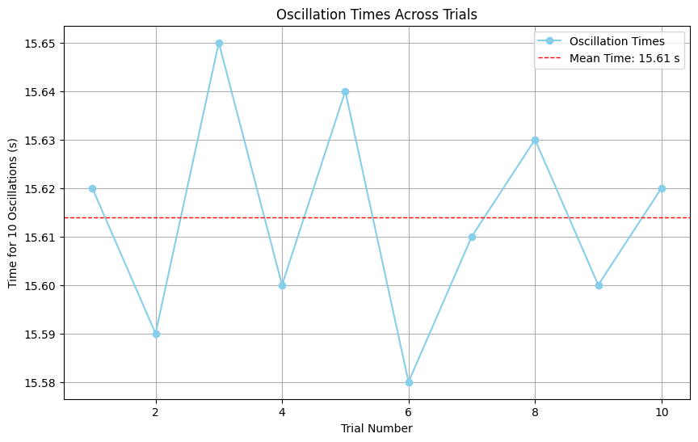

# Problem 1

# Measuring Earth's Gravitational Acceleration with a Pendulum

## Motivation

The acceleration $g$ due to gravity is a fundamental physical constant that governs the motion of objects in a gravitational field. This experiment explores how a simple pendulum can be used to determine $g$ accurately, emphasizing the importance of precise measurements and uncertainty analysis in experimental physics.

---


## Deliverables
                                     

### Calculations and Results

* Mean period: $\overline{T}_{10}$

* Period of one oscillation: $T \pm \Delta T$

* Measured $g \pm \Delta g$

---

## Procedure

### Materials

\- A string (1 or 1.5 meters long)

\- A small weight (e.g., bag of coins, bag of sugar, key chain)

\- Stopwatch or smartphone timer

\- Ruler or measuring tape

### Setup

\(1\). Attach the weight to the string and secure the other end to a sturdy support.

\(2\). Measure the length of the pendulum, $L$, from the suspension point to the center of the weight using a ruler or measuring tape.

   \- Record the resolution of the measuring tool (e.g., 1 mm).

   \- Calculate the uncertainty in $L$ as half the resolution: 
  
   $$ \Delta L = \frac{\text{Resolution}} {2}$$


### Data Collection

\(1\). Displace the pendulum slightly ($<15^\circ$) and release it.

\(2\). Measure the time for 10 full oscillations ($T_{10}$) using a stopwatch. 

\(3\). Repeat the measurement 10 times to obtain 10 values of $T_{10}$.

\(4\). Calculate:

   \- The mean time for 10 oscillations: $\overline{T}_{10} = \frac{\sum T_{10}}{10}$.

   \- The standard deviation: $\sigma_{T_{10}} = \sqrt{\frac{\sum (T_{10} - \overline{T}_{10})^2}{n - 1}}$, where $n = 10$.

   \- The uncertainty in the mean: $\Delta \overline{T}_{10} = \frac{\sigma_{T_{10}}}{\sqrt{n}}$.

---

## Calculations

### 1. Calculate the Period

The period of one oscillation is:

$$
T = \frac{\overline{T}_{10}}{10}
$$

The uncertainty in $T$ is:

$$
\Delta T = \frac{\Delta \overline{T}_{10}}{10}
$$

### 2. Determine $g$

Using the formula for the period of a pendulum:

$$
T = 2\pi \sqrt{\frac{L}{g}}
$$

Rearranging for $g$:

$$
g = \frac{4\pi^2 L}{T^2}
$$

The uncertainty in $g$ is propagated as:

$$
\Delta g = g \sqrt{\left(\frac{\Delta L}{L}\right)^2 + \left(2\frac{\Delta T}{T}\right)^2}
$$

---


### Simulation
Below is the Python implementation of Buffon’s Needle method:

```python
import numpy as np
import matplotlib.pyplot as plt

# Function to calculate uncertainties
def calculate_uncertainties(L, delta_L, times):
    n = len(times)
    mean_time_10 = np.mean(times)
    std_dev_time_10 = np.std(times, ddof=1)
    delta_mean_time_10 = std_dev_time_10 / np.sqrt(n)

    T = mean_time_10 / 10
    delta_T = delta_mean_time_10 / 10

    g = (4 * np.pi**2 * L) / T**2
    delta_g = g * np.sqrt((delta_L / L)**2 + (2 * delta_T / T)**2)

    return T, delta_T, g, delta_g

# Data collection (Example Values)
L = 1.0  # Pendulum length in meters
delta_L = 0.001  # Uncertainty in length in meters
times = [15.62, 15.59, 15.65, 15.60, 15.64, 15.58, 15.61, 15.63, 15.60, 15.62]  # Time for 10 oscillations in seconds

# Perform calculations
T, delta_T, g, delta_g = calculate_uncertainties(L, delta_L, times)

# Display results
print("Mean Period for 1 Oscillation (T): {:.4f} s ± {:.4f} s".format(T, delta_T))
print("Gravitational Acceleration (g): {:.4f} m/s^2 ± {:.4f} m/s^2".format(g, delta_g))

# Visualization
plt.figure(figsize=(10, 6))
plt.plot(range(1, len(times) + 1), times, marker='o', linestyle='-', color='skyblue', label='Oscillation Times')
plt.axhline(np.mean(times), color='red', linestyle='dashed', linewidth=1, label=f"Mean Time: {np.mean(times):.2f} s")
plt.xlabel("Trial Number")
plt.ylabel("Time for 10 Oscillations (s)")
plt.title("Oscillation Times Across Trials")
plt.legend()
plt.grid()
plt.show()

```




## Analysis

\- Compare your experimental value of $g$ with the standard value $9.81 \, \text{m/s}^2$.

\- Explore how the precision of $L$ and $T_{10}$ affects the final uncertainty in g.

\- Discuss the variability in $T_{10}$ measurements and its impact on the mean period and uncertainty.

## Discussion

\* **Assumptions and Limitations:**

  \* Assume air resistance and friction at the pivot are negligible.

  \* Small-angle approximation ($<15^\circ$) is used to ensure the formula for $g$ is valid.
  

---
